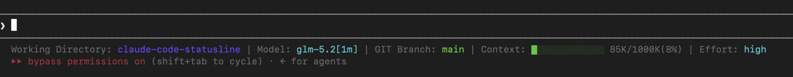

# claude-code-statusline

> 一条信息密集的 Claude Code statusline：当前目录 / 模型 / Git 分支与改动 / Context 用量进度条 / Effort 等级。纯 bash + jq，无运行时依赖（除 jq）。

## 效果展示

<!-- 截图占位：把你 statusline 的实际截图存为 preview.png 放到仓库根目录，
     然后取消下面一行的注释即可显示在此处。 -->
<!--  -->

终端里的文本示意（实际带颜色）：

```
Working Directory: my-app | Model: Sonnet 4.5 | GIT Branch: main | Changes: +12 -3 | Context: ███████░░░░░░ 45K/200K(22%) | Effort: high
```

- Context 进度条随用量变色：< 60% 绿色、< 80% 黄色、≥ 80% 红色
- `Changes` 仅在存在未提交改动时显示
- `Effort` 仅在等级非默认 `medium` 时显示

## Features

- **Working Directory** — 当前项目目录名
- **Model** — 当前模型显示名
- **GIT Branch** — 当前分支（仅在 git 仓库内显示）
- **Changes** — 相对 HEAD 的增 / 删行数（仅有改动时显示）
- **Context** — 用量进度条 + 已用/总量 + 百分比，三段变色
- **Effort** — 推理强度（仅非 medium 时显示）

## 依赖

- [`jq`](https://jqlang.github.io/jq/) — 解析 Claude Code 传入的 JSON
- `git` — 读取分支与改动（不在 git 仓库则不显示分支段）

检测是否已安装：`jq --version`

macOS 安装 jq：

```bash
brew install jq
```

## 安装

### Step 1 — 确认 jq 已安装

```bash
brew install jq      # macOS；Linux 多数发行版自带，用对应包管理器安装即可
```

### Step 2 — 放置脚本到 `~/.claude/statusline.sh`

方式 A · 直接下载单文件：

```bash
curl -fsSL https://raw.githubusercontent.com/DragonL641/claude-code-statusline/main/statusline.sh \
  -o ~/.claude/statusline.sh
chmod +x ~/.claude/statusline.sh
```

方式 B · clone 仓库后拷贝：

```bash
git clone https://github.com/DragonL641/claude-code-statusline.git
cp claude-code-statusline/statusline.sh ~/.claude/statusline.sh
chmod +x ~/.claude/statusline.sh
```

### Step 3 — 配置 `~/.claude/settings.json`

先备份现有配置：

```bash
cp ~/.claude/settings.json ~/.claude/settings.json.bak
```

在 `settings.json` 最外层对象 `{ }` 中加入 `statusLine` 段：

```json
{
  "statusLine": {
    "type": "command",
    "command": "~/.claude/statusline.sh",
    "padding": 0
  }
}
```

> 注意 JSON 格式：如果你的 `settings.json` 已有其它字段，把 `statusLine` 与它们并列；若 `statusLine` 后面还有字段，需在它后面补一个逗号。

重启 Claude Code 即可看到 statusline。

## 卸载

1. 删除脚本：`rm ~/.claude/statusline.sh`
2. 从 `~/.claude/settings.json` 移除 `statusLine` 段（或恢复 `.bak` 备份）

## 自定义

所有行为都直接写在脚本里，按需修改即可：

| 想改什么 | 位置 |
|---|---|
| 颜色 | 文件头的 ANSI 变量（`BLUE`/`GREEN`/`YELLOW`/`RED`/`CYAN`/`DIM`） |
| 进度条宽度 | `bar_width=13` |
| 变色阈值（60% / 80%） | 颜色判断分支 |
| 显示 / 隐藏某个字段 | 对应的 `printf` 块，注释掉即可 |
| 字段标签文案 | 各 `printf` 中的 `Working Directory:` / `Model:` 等 |

## 工作原理

Claude Code 每次渲染 statusline 时，把一段 JSON 通过 **stdin** 传给 `statusLine.command` 指定的脚本，脚本输出的第一行即为状态栏内容。JSON 含 `model`、`workspace.current_dir`、`context_window`（含 token 用量与百分比）、`effort` 等字段。本脚本用 `jq` 解析这些字段并拼装输出。

## License

[MIT](LICENSE) © DragonL641
